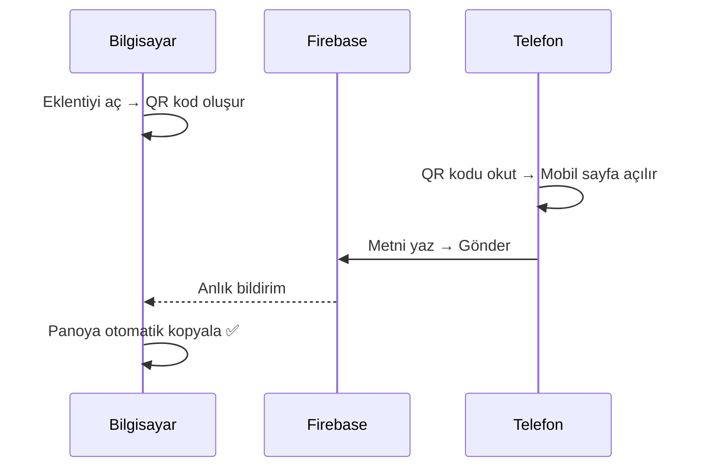

<div align="center">

# ✈️ AirPaste

### Cloud Clipboard — Instant Text Transfer Between Devices

[](https://github.com/Sauth-09/AirPaster)
[](https://firebase.google.com/)
[](https://developer.chrome.com/docs/extensions/mv3/)
[](LICENSE)

<br/>

**AirPaste**, bilgisayar ile telefon arasında anlık metin ve link aktarımını sağlayan bir **Chrome eklentisidir.**
<br/>QR kodu okut, metni gir, gönder — hepsi bu kadar.

<br/>

```
📋 Extension → QR Code → 📱 Mobile → Firebase → 💻 Clipboard
```

<br/>

---

</div>

## ✨ Özellikler

<table>
<tr>
<td width="50%">

### 🖥️ Chrome Eklentisi
- ⚡ Tek tıkla benzersiz oda oluşturma
- 📱 Otomatik QR kod üretimi
- 📋 Gelen metin anında panoya kopyalanır
- 🔄 Yeni oda oluşturma butonu
- 🎨 Premium dark tema tasarım

</td>
<td width="50%">

### 📱 Mobil Web Arayüzü
- 🌐 QR kod ile anında bağlantı
- ✏️ Geniş metin alanı (10.000 karakter)
- 🚀 Tek tuşla gönderim
- 📊 Karakter sayacı
- 📐 Tam responsive tasarım

</td>
</tr>
</table>

## 🎯 Nasıl Çalışır?



<table>
<tr>
<td align="center" width="25%">

### 1️⃣
**Eklentiyi Aç**
<br/><sub>Chrome'da AirPaste ikonuna tıkla</sub>

</td>
<td align="center" width="25%">

### 2️⃣
**QR Kodu Okut**
<br/><sub>Telefonunla QR kodu tara</sub>

</td>
<td align="center" width="25%">

### 3️⃣
**Metni Gönder**
<br/><sub>Metin veya linki yaz, gönder</sub>

</td>
<td align="center" width="25%">

### 4️⃣
**Kopyalandı!**
<br/><sub>Bilgisayar panosuna anında kopyalanır</sub>

</td>
</tr>
</table>

## 🏗️ Mimari

```
AirPaste/
├── 📁 extension/                 # Chrome Eklentisi (Manifest V3)
│   ├── 📄 manifest.json          # Eklenti yapılandırması
│   ├── 📄 popup.html             # Popup arayüzü
│   ├── 📄 popup.css              # Premium dark tema stilleri
│   ├── 📁 src/
│   │   ├── 📄 popup.js           # UI controller (entry point)
│   │   ├── 📁 config/
│   │   │   └── 📄 firebase-config.js
│   │   ├── 📁 services/
│   │   │   ├── 📄 firebase-service.js   # Firebase dinleme & temizleme
│   │   │   ├── 📄 room-service.js       # Oda ID üretimi & URL oluşturma
│   │   │   ├── 📄 qr-service.js         # QR kod üretimi
│   │   │   └── 📄 clipboard-service.js  # Pano işlemleri
│   │   └── 📁 utils/
│   │       ├── 📄 constants.js
│   │       └── 📄 dom-helpers.js
│   ├── 📁 dist/                  # Bundle çıktısı
│   └── 📁 icons/                 # Eklenti ikonları
│
├── 📁 mobile-web/                # Mobil Web Sayfası (GitHub Pages)
│   ├── 📄 index.html             # Responsive mobil arayüz
│   ├── 📄 styles.css             # Mobil tema stilleri
│   ├── 📁 src/
│   │   ├── 📄 app.js             # App controller (entry point)
│   │   ├── 📁 config/
│   │   │   └── 📄 firebase-config.js
│   │   ├── 📁 services/
│   │   │   ├── 📄 firebase-service.js   # Firebase'e veri gönderme
│   │   │   └── 📄 url-service.js        # URL parametre okuma
│   │   └── 📁 utils/
│   │       └── 📄 constants.js
│   └── 📁 dist/                  # Bundle çıktısı
│
├── 📄 esbuild.config.mjs         # Build yapılandırması
├── 📄 package.json
└── 📄 LICENSE
```

## 🛠️ Teknoloji Yığını

| Katman | Teknoloji | Amaç |
|:---|:---|:---|
| **Eklenti** | Chrome Extension (Manifest V3) | Bilgisayar tarafı arayüz |
| **Mobil** | Vanilla HTML/CSS/JS | Telefon tarafı arayüz |
| **Backend** | Firebase Realtime Database | Anlık veri senkronizasyonu |
| **QR** | qrcode.js | QR kod üretimi |
| **Bundler** | esbuild | Hızlı build & minify |
| **Hosting** | GitHub Pages | Mobil web sayfası barındırma |

## 🚀 Kurulum

### Gereksinimler

- [Node.js](https://nodejs.org/) v18+
- [npm](https://www.npmjs.com/) v9+
- Google Chrome tarayıcı
- [Firebase](https://firebase.google.com/) hesabı

### 1. Projeyi Klonla

```bash
git clone https://github.com/Sauth-09/AirPaster.git
cd AirPaster
```

### 2. Bağımlılıkları Yükle

```bash
npm install
```

### 3. Firebase Yapılandırması

Firebase Console'dan yeni bir proje oluşturun ve **Realtime Database**'i aktifleştirin.

Her iki config dosyasını da kendi Firebase bilgilerinizle güncelleyin:

```
extension/src/config/firebase-config.js
mobile-web/src/config/firebase-config.js
```

<details>
<summary>📋 Firebase Güvenlik Kuralları</summary>

```json
{
  "rules": {
    "rooms": {
      "$roomId": {
        ".read": true,
        ".write": true
      }
    }
  }
}
```

> ⚠️ Bu kurallar geliştirme içindir. Üretim ortamında daha kısıtlayıcı kurallar kullanın.

</details>

### 4. Build

```bash
# Tüm bileşenleri build et
npm run build

# Sadece extension
npm run build:extension

# Sadece mobile-web
npm run build:mobile

# Geliştirme modu (watch)
npm run dev
```

### 5. Chrome'a Yükle

1. Chrome'da `chrome://extensions` adresine gidin
2. **Geliştirici modu**'nu açın (sağ üst köşe)
3. **Paketlenmemiş öğe yükle** butonuna tıklayın
4. `extension/` klasörünü seçin
5. ✅ AirPaste eklentisi hazır!

### 6. Mobil Web Deploy

`mobile-web/` klasörünü **GitHub Pages** üzerinden yayınlayın.

`extension/src/utils/constants.js` dosyasındaki `MOBILE_WEB_BASE_URL` değerini kendi GitHub Pages URL'nizle güncelleyin:

```js
export const MOBILE_WEB_BASE_URL = "https://YOUR-USERNAME.github.io/YOUR-REPO/mobile-web/";
```

## 🎨 Tasarım Prensipleri

<table>
<tr>
<td align="center">🌙</td>
<td><strong>Dark Theme</strong><br/><sub>Göz yormayan premium karanlık tema</sub></td>
<td align="center">💎</td>
<td><strong>Glassmorphism</strong><br/><sub>Modern cam efekti tasarım dili</sub></td>
</tr>
<tr>
<td align="center">🔮</td>
<td><strong>Purple Accent</strong><br/><sub>Tutarlı renk paleti (#8B5CF6)</sub></td>
<td align="center">✨</td>
<td><strong>Micro-animations</strong><br/><sub>Pulse, fade, slide animasyonları</sub></td>
</tr>
<tr>
<td align="center">📐</td>
<td><strong>Responsive</strong><br/><sub>Her ekran boyutuna uyumlu</sub></td>
<td align="center">🧩</td>
<td><strong>Modüler</strong><br/><sub>Servis tabanlı temiz mimari</sub></td>
</tr>
</table>

## 📐 Kod Mimarisi

Proje **Clean Architecture** prensiplerine uygun olarak tasarlanmıştır:

- ✅ **Dependency Injection** — Servisler factory fonksiyonlar ile oluşturulur
- ✅ **Interface Segregation** — Her servis `Object.freeze()` ile kapsüllenmiştir
- ✅ **Single Responsibility** — Her modül tek bir işten sorumludur
- ✅ **No Business Logic in UI** — İş mantığı servislerde, UI sadece koordine eder
- ✅ **Functional Programming** — Saf fonksiyonlar ve immutable yapılar

## 🤝 Katkıda Bulunma

Katkılarınızı memnuniyetle karşılıyoruz! 

1. Projeyi **fork** edin
2. Feature branch oluşturun (`git checkout -b feature/amazing-feature`)
3. Değişikliklerinizi commit edin (`git commit -m 'Add amazing feature'`)
4. Branch'e push edin (`git push origin feature/amazing-feature`)
5. **Pull Request** açın

## 📄 Lisans

Bu proje [MIT Lisansı](LICENSE) ile lisanslanmıştır.

---

<div align="center">

**Geliştirici:** [Sauth-09](https://github.com/Sauth-09)

⭐ Bu projeyi beğendiyseniz bir **yıldız** bırakmayı unutmayın!

<br/>

<sub>AirPaste ile cihazlar arası metin aktarımı artık çok kolay. 🚀</sub>

</div>